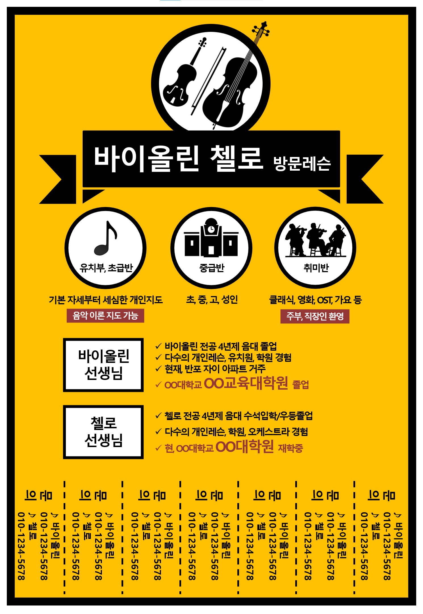
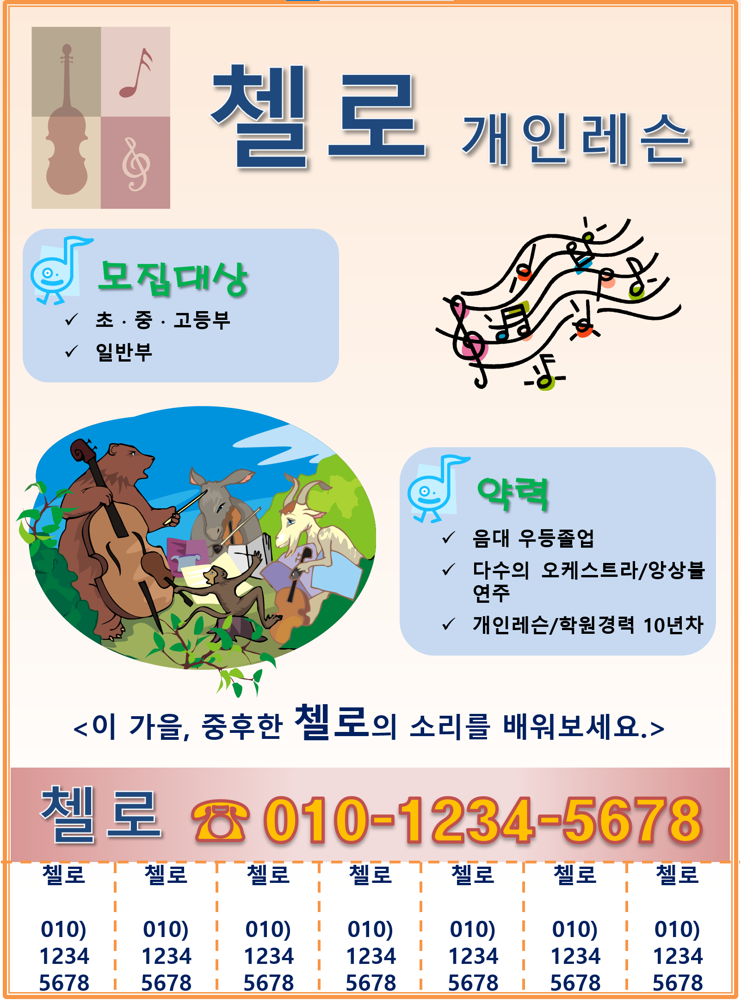

# 과외 전단지 만들기: 효과적인 과외 홍보를 위한 가이드
안녕하세요! 오늘은 과외 선생님들이 효과적인 과외 전단지를 만드는 방법에 대해 소개하려고 합니다. 잘 디자인된 전단지는 잠재적인 학생들과 학부모들에게 자신을 알리고, 더 많은 과외 기회를 창출하는 데 큰 도움이 됩니다. 여기서는 전단지 제작의 핵심 요소와 팁을 다룰 것입니다.

 

## **1. 전단지의 목적과 타겟 설정하기**

#### 목적 정의하기
과외 전단지를 만들기 전에, 전단지의 목적을 명확히 정의하는 것이 중요합니다. 전단지의 목적은 다음과 같습니다:
- 새로운 학생 모집
- 과외 수업 홍보
- 특정 과목에 대한 전문성 알리기

#### 타겟 설정하기
전단지를 받게 될 잠재적인 학생이나 학부모를 생각하면서 타겟을 설정하세요. 초등학생, 중학생, 고등학생, 대학생 등 타겟에 따라 내용과 디자인을 조정해야 합니다.

 

________
 

## **2. 매력적인 디자인 요소**

#### 깔끔하고 전문적인 레이아웃
전단지는 첫인상이 중요합니다. 깔끔하고 전문적인 레이아웃을 사용하여 신뢰성을 높이세요. 너무 많은 정보를 담지 않고, 중요한 정보를 눈에 띄게 배치하세요.

#### 시각적 요소 활용
이미지나 그래픽을 적절히 활용하여 시각적으로 매력적인 전단지를 만드세요. 과외 수업과 관련된 이미지나, 학생들이 공부하는 모습을 담은 사진을 사용하는 것이 좋습니다.

#### 색상과 폰트 선택
읽기 쉽고, 주목을 끌 수 있는 색상과 폰트를 선택하세요. 과도한 색상 사용은 피하고, 중요한 정보는 강조할 수 있도록 합니다.

 

________
 

## **3. 필수 정보 포함하기**

#### 과외 선생님의 정보
과외 전단지에는 다음과 같은 과외 선생님의 정보가 포함되어야 합니다:

- 이름
- 연락처 (전화번호, 이메일)
- 경력 및 자격증
- 전공 및 특화 과목

#### 수업 정보
수업 시간과 장소, 수업 방식(온라인, 오프라인), 수업료 등을 명확히 기재하세요. 예를 들어:

- 수업 시간: 주 2회, 회당 1시간
- 수업 장소: 학생의 집 또는 온라인
- 수업료: 시간당 3만원

#### 성과 및 후기
과거 학생들의 성적 향상 사례나 후기를 포함하여 신뢰성을 높이세요. 예를 들어:

- "학생 A, 수학 성적 30점 향상!"
- "영어 회화 과외 후, 영어 시험 점수 20점 상승!"

 

________
 

## **4. 연락처와 추가 정보 제공**
명확한 연락처와 추가 정보를 제공하여 관심 있는 사람들이 쉽게 연락할 수 있도록 합니다. QR 코드를 사용하여 웹사이트나 블로그로 연결하면 더 많은 정보를 제공할 수 있습니다.

#### 소셜 미디어 및 온라인 프로필
소셜 미디어나 온라인 프로필 링크를 포함하여 더 많은 정보를 제공하고, 잠재 고객이 당신에 대해 더 잘 알 수 있도록 합니다.

 

________
 

## **5. 배포 전략**
#### 배포 장소 선택
잠재적인 학생들이 많이 모이는 장소에 전단지를 배포하세요. 학교 주변, 학원, 도서관, 커뮤니티 센터 등이 좋은 장소입니다.

#### 온라인 배포
온라인에서도 전단지를 배포할 수 있습니다. 지역 커뮤니티 사이트나 소셜 미디어 그룹을 활용하여 전단지를 공유하세요.

 

________
 

