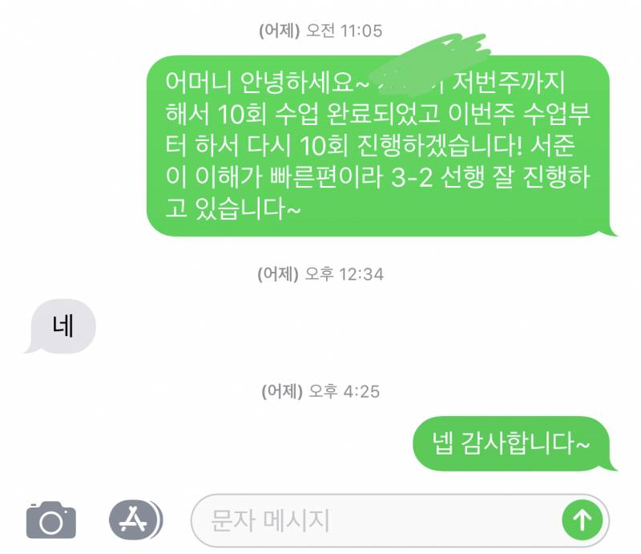

# 과외비 요청 문자 작성하기

안녕하세요! 오늘은 과외 선생님들이 과외비를 요청할 때 사용할 수 있는 예의 바르고 효과적인 문자 작성법을 소개하려고 합니다. 학생이나 학부모에게 과외비를 요청하는 것은 때로는 부담스러울 수 있지만, 적절한 문구와 매너를 갖추면 문제 없이 요청할 수 있습니다. 아래에서 다양한 상황에 맞는 예시와 팁을 확인해보세요.



<br>

# **1. 기본적인 과외비 요청 문자**

과외비를 요청하는 기본적인 문구는 간결하고 예의 바르게 작성하는 것이 중요합니다. 다음은 기본적인 과외비 요청 문자 예시입니다.

```text
안녕하세요, [학생 이름] 어머님/아버님. [과외 선생님 이름]입니다.
다름이 아니오라 이번 달 과외비를 요청드리려고 연락드렸습니다.
이번 달 과외비는 [금액]원입니다.
불편하지 않으실 때 입금 부탁드립니다.
감사합니다.
```

<br>

________
<br>

# **2. 미납된 과외비 요청 문자**

때로는 과외비가 기한 내에 입금되지 않을 때도 있습니다. 이럴 때는 부드럽게 상기시켜주는 문구를 사용하는 것이 좋습니다.

```text
안녕하세요, [학생 이름] 어머님/아버님. [과외 선생님 이름]입니다.
다름이 아니오라 지난 달 과외비 [금액]원이 아직 입금되지 않아서 연락드렸습니다.
혹시 입금에 어려움이 있으신지 궁금합니다.
확인 부탁드리며, 불편하지 않으실 때 입금 부탁드립니다.
감사합니다.
```

<br>

________
<br>

# **3. 정기 과외비 요청 문자**

매달 정기적으로 과외비를 요청할 때는 조금 더 친근하고 일상적인 문구를 사용할 수 있습니다.

```text
안녕하세요, [학생 이름] 어머님/아버님. [과외 선생님 이름]입니다.
벌써 한 달이 지나 과외비를 요청드릴 때가 되었습니다.
이번 달 과외비는 [금액]원입니다.
편하신 시간에 입금 부탁드립니다.
감사합니다.
```

<br>

________
<br>

# **4. 과외비 입금 확인 감사 문자**

과외비가 입금되었을 때 감사의 인사를 전하는 문자는 좋은 관계를 유지하는 데 도움이 됩니다.

```text
안녕하세요, [학생 이름] 어머님/아버님. [과외 선생님 이름]입니다.
과외비 [금액]원 잘 입금 확인했습니다.
항상 신경 써 주셔서 감사합니다.
즐거운 하루 보내세요!
```

<br>

________
<br>

# **5. 추가 팁**

###명확한 정보 제공
과외비 요청 시 금액, 입금 기한, 계좌 정보 등 필요한 정보를 명확히 제공하세요. 이는 불필요한 혼선을 줄이고 신속한 입금을 유도할 수 있습니다.

###예의와 존중
항상 예의와 존중을 잊지 마세요. 존중하는 태도로 요청하면 학생이나 학부모도 더 기꺼이 응답할 것입니다.

###유연한 대응
만약 입금이 늦어지거나 문제가 발생할 경우, 유연하게 대응하고 문제를 해결하려는 자세를 가지세요. 이는 장기적인 신뢰 관계를 구축하는 데 중요합니다.

<br>

________
<br>

# **결론**

과외비 요청 문자는 과외 선생님과 학부모 사이의 중요한 소통 수단입니다. 예의 바르고 명확한 문구를 사용하여 과외비를 요청하고, 입금 확인 후 감사의 인사를 전하는 것이 좋습니다. 위의 예시와 팁을 참고하여 과외비 요청 문자를 작성하고, 원활한 과외 활동을 이어가시길 바랍니다.
