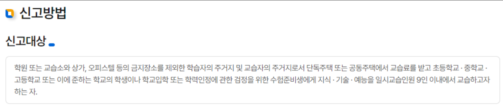

# 개인과외 신고 절차 안내

안녕하세요! 오늘은 개인과외를 시작하려는 분들을 위해 개인과외 신고 절차와 방법을 안내하려고 합니다. 과외는 법적으로 신고가 필요한 경우가 많기 때문에, 올바른 절차를 따라 신고하여 법적 문제를 예방하는 것이 중요합니다. 아래에서 단계별로 신고 절차를 설명해 드리겠습니다.

 

## **1. 개인과외 신고의 필요성**

개인과외를 법적으로 신고하는 것은 과외 선생님과 학생, 학부모 모두에게 중요한 일입니다. 이는 법적 보호를 받을 수 있고, 신뢰할 수 있는 과외 서비스를 제공하는 데 도움이 됩니다. 미신고 시 벌금 등의 법적 처벌을 받을 수 있습니다.

 

________
 

## **2. 신고 준비 사항**

### 필요 서류 준비

개인과외 신고를 위해 다음과 같은 서류를 준비해야 합니다:
- 신분증 (주민등록증, 운전면허증 등)
- 최종 학력 증명서 (졸업증명서, 재학증명서 등)
- 주민등록등본 (주소지 확인용)
- 과외 계약서 (학생 또는 학부모와의 계약 내용)

### 신고 장소 확인

개인과외 신고는 주로 관할 교육청에서 이루어집니다. 본인이 속한 지역의 교육청을 확인하고 방문하거나, 온라인으로 신고할 수 있는지 확인합니다.

 

________
 

## **3. 신고 절차**

### 1. 온라인 신고

온라인 신고는 교육청 홈페이지나 관련 포털 사이트를 통해 가능합니다. 각 지역 교육청의 홈페이지를 방문하여 개인과외 신고 메뉴를 찾고, 안내에 따라 필요한 정보를 입력하고 서류를 업로드합니다.

### 2. 방문 신고

관할 교육청을 직접 방문하여 신고하는 방법입니다. 준비한 서류를 지참하고, 교육청 민원실에서 개인과외 신고서를 작성합니다. 담당자의 안내에 따라 신고 절차를 진행합니다.

### 3. 전화 문의

온라인 신고나 방문 신고가 어려운 경우, 교육청에 전화로 문의하여 상세한 절차와 방법을 안내받을 수 있습니다. 각 교육청의 연락처는 교육청 홈페이지에서 확인할 수 있습니다.

 

________
 

## **4. 신고 후 절차**

### 1. 신고 확인

신고가 완료되면, 교육청에서 신고 확인증을 발급해 줍니다. 이 확인증은 개인과외를 합법적으로 진행할 수 있는 증빙서류로 사용됩니다.

### 2. 정기 보고

일부 지역에서는 정기적으로 과외 활동에 대한 보고를 요구할 수 있습니다. 이 경우, 정해진 기간에 맞춰 보고서를 제출하여야 합니다.

### 3. 법적 준수

개인과외를 진행하면서 관련 법규를 준수해야 합니다. 교육청의 지침을 따르고, 과외 계약서에 명시된 내용을 성실히 이행합니다.

 

________
 

## **5. 자주 묻는 질문**

### Q1: 개인과외 신고는 반드시 해야 하나요?
네, 법적으로 과외를 합법적으로 운영하기 위해서는 반드시 신고를 해야 합니다. 미신고 시 법적 처벌을 받을 수 있습니다.

### Q2: 신고 비용이 있나요?
개인과외 신고 자체는 무료이지만, 준비해야 할 서류 발급에 소정의 수수료가 발생할 수 있습니다.

### Q3: 과외 계약서는 어떻게 작성하나요?
과외 계약서에는 수업 내용, 시간, 장소, 과외비, 환불 규정 등을 명시해야 합니다. 교육청 홈페이지에서 제공하는 표준 계약서를 참고할 수 있습니다.

 

________
 

## **결론**

개인과외 신고는 과외 선생님과 학생, 학부모 모두에게 중요한 절차입니다. 올바른 절차를 통해 신고하고, 법적 보호를 받으며 신뢰할 수 있는 과외 서비스를 제공하세요. 위의 안내를 참고하여 개인과외 신고를 원활히 진행하시길 바랍니다.

이 글이 개인과외 신고 절차에 도움이 되길 바랍니다!

